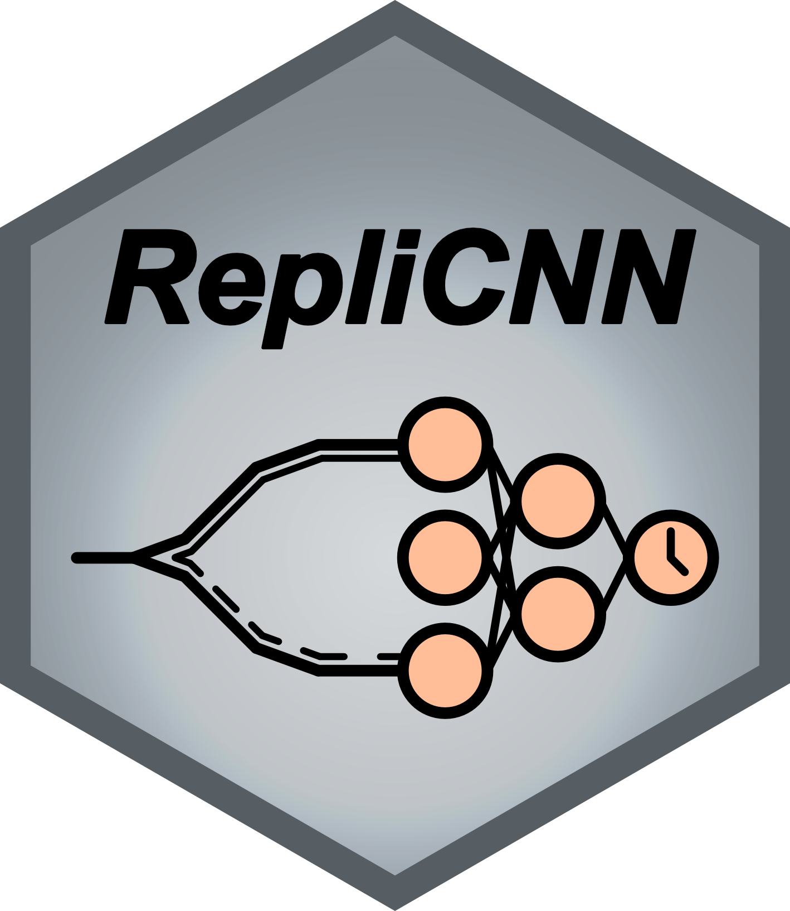

# RepliCNN <a href="https://github.com/zarnackgroup/replicnn"></a>

[](https://pypi.org/project/replicnn/)
[](https://www.python.org/)
[-blue)](https://github.com/zarnackgroup/replicnn/blob/main/CITATION.cff)
[](https://github.com/zarnackgroup/replicnn/blob/main/LICENSE)

RepliCNN is a tool for predicting replication timing from GLOE-Seq, TrAEL-Seq, or OK-Seq data using convolutional neural networks.

## Installation
We recommend installing RepliCNN via the PyPI using pip:
```bash
pip install replicnn
```

### Other installation/running options
<details>
<summary>Installing from source</summary>

You can install RepliCNN from source via:
```bash
pip install 'replicnn @ git+https://github.com/zarnackgroup/replicnn.git@main'
```
</details>

<details>
<summary>Running as container</summary>

You can also use RepliCNN as a Docker/Singularity/Apptainer container. We provide pre-built containers as well as Dockerfiles and Singularity/Apptainer definition files. Ensure that you have Docker/Singularity/Apptainer available in your PATH.
```bash
# Using Docker
user@dev:/tmp$ docker run ghcr.io/zarnackgroup/replicnn:0.1.0 --version
0.1.0

# Using Singularity
user@dev:/tmp$ singularity run ghcr.io/zarnackgroup/replicnn:0.1.0 --version
0.1.0

# Using Apptainer
user@dev:/tmp$ apptainer run ghcr.io/zarnackgroup/replicnn:0.1.0 --version
0.1.0
```
</details>

## Commands and how to use them
The main way how to use RepliCNN is through its command line interface. 
### replicnn
```bash
user@dev:/tmp$ replicnn --help
usage: replicnn [-h] [-v] {prepare,train,predict,analyse,quantify,visualise} ...

RepliCNN - Replication timing prediction and analyses

positional arguments:
  {prepare,train,predict,analyse,quantify,visualise}
                        Commands
    prepare             Prepare data format for this tool.
    train               Train a model.
    predict             Predict timing for file.
    analyse             Analyse data for characteristics.
    quantify            Quantify timing changes.
	visualise			Visualise your results.

options:
  -h, --help            show this help message and exit
  -v, --version         show program's version number and exit
```
For additional help and documentation, please check out `replicnn --help` or `replicnn {prepare,train,predict,analyse,quantify} --help` or the corresponding publication.

### Subcommands
<details>
<summary>replicnn prepare</summary>

```bash
user@dev:/tmp$ replicnn prepare --help
usage: RepliCNN prepare [-h] -fwd FORWARD -rev REVERSE -bs BINSIZE -cs CHROMSIZES -o OUTPATH [-t TIMING] [-i] [-nl]

RepliCNN prepare - Prepare a file in the SDF format for usage in the tool and user specific analyses.

options:
  -h, --help            show this help message and exit
  -fwd FORWARD, --forward FORWARD
                        Path to the forward bigWig file.
  -rev REVERSE, --reverse REVERSE
                        Path to the reverse bigWig file.
  -bs BINSIZE, --binsize BINSIZE
                        Binsize to use.
  -cs CHROMSIZES, --chromsizes CHROMSIZES
                        Path to a chromsizes file.
  -o OUTPATH, --outpath OUTPATH
                        File where the output should be written to.
  -t TIMING, --timing TIMING
                        Path to a timing file.
  -i, --invert          Invert phasing of the track.
  -nl, --nolog          Disable logging.
```

</details>

<details>
<summary>replicnn train</summary>

```bash
user@dev:/tmp$ replicnn train --help
usage: RepliCNN train [-h] -i INPUT [INPUT ...] -o OUTPATH [-g] [-ws WINDOWSIZE] [-e EPOCHS] [-bs BATCHSIZE] [-nes] [-v VALIDATIONSPLIT] [-lr LEARNINGRATE] [-cv] [-nl]

RepliCNN train - Train a model using SDF-file(s). Model quality can be assessed using the -cv option performing a Leave-One-Chromosome-Out Cross-Validation.

options:
  -h, --help            show this help message and exit
  -i INPUT [INPUT ...], --input INPUT [INPUT ...]
                        Path(-s) to one/multiple sdf file(-s).
  -o OUTPATH, --outpath OUTPATH
                        Folder where the model should be written to.
  -g, --gpu             Enables training on gpu. Defaults to False
  -ws WINDOWSIZE, --windowsize WINDOWSIZE
                        Window size for chunks. Defaults to 201.
  -e EPOCHS, --epochs EPOCHS
                        Number of epochs to train for. Defaults to 300.
  -bs BATCHSIZE, --batchsize BATCHSIZE
                        Batch size. Defaults to 32.
  -nes, --noearlystopping
                        Whether to inactivate early stopping during training. Defaults to False.
  -v VALIDATIONSPLIT, --validationsplit VALIDATIONSPLIT
                        Percent of data used as validation. Defaults to 0.1.
  -lr LEARNINGRATE, --learningrate LEARNINGRATE
                        Learning rate for Adam optimizer. Defaults to 0.001.
  -cv, --crossvalidate  Leave-One-Chromosome-Out Cross-Validation on the given dataset. Only compatible with one SDF-file.
  -nl, --nolog          Disable logging.
```

</details>

<details>
<summary>replicnn predict</summary>

```bash
user@dev:/tmp$ replicnn predict --help
usage: RepliCNN predict [-h] -i INPUT -m MODELPATH [-o OUTPATH] [-g] [-nl]

RepliCNN predict - Predict timing for a SDF-file using a previously trained model.

options:
  -h, --help            show this help message and exit
  -i INPUT, --input INPUT
                        Path to one sdf-file.
  -m MODELPATH, --modelpath MODELPATH
                        Path to a model file.
  -o OUTPATH, --outpath OUTPATH
                        File where the output should be written to.
  -g, --gpu             Enables prediction on gpu. Defaults to False
  -nl, --nolog          Disable logging.
```
</details>

<details>
<summary>replicnn analyse</summary>

```bash
user@dev:/tmp$ replicnn analyse --help
usage: RepliCNN analyse [-h] -i INPUT -o OUTPATH [-s1 SMOOTHLOG2] [-s2 SMOOTHRFD] [-nl]

RepliCNN analyse - Analyse a SDF-file for origins of rpelication/initiation zones, termination zones, constant timing regions, timing transition regions, and replication for directionality.

options:
  -h, --help            show this help message and exit
  -i INPUT, --input INPUT
                        Path(-s) to one sdf file.
  -o OUTPATH, --outpath OUTPATH
                        Folder where the output should be written to.
  -s1 SMOOTHLOG2, --smoothlog2 SMOOTHLOG2
                        Smoothing factor for ORI and TERM identification.
  -s2 SMOOTHRFD, --smoothrfd SMOOTHRFD
                        Smoothing factor for TTR and RFD identification
  -nl, --nolog          Disable logging.
```
</details>

<details>
<summary>replicnn visualise (currently not supported)</summary>

```bash
user@dev:/tmp$ replicnn visualise --help

```
</details>

## Import RepliCNN into a python script/jupyter notebook
Besides the usage as a command line tool, RepliCNN can also be imported into a python script or jupyter notebook. The results of the commandline  tool and the imported version are equivalent.

```bash
user@dev:/tmp$ python -c "import replicnn; print(replicnn.__version__)"
0.1.0
```

## Getting help
If you've found a bug, would like to suggest a new feature or you have any issues regarding RepliCNN installation, walkthrough, and output interpretation please open a new [issue](https://github.com/zarnackgroup/replicnn/issues).

## Acknowledgements
Funded by the Deutsche Forschungsgemeinschaft (DFG, German Research Foundation) – Project-ID 393547839 – SFB 1361.

## Citing
If you use RepliCNN in your research, please cite this repository like this:

Dominik Stroh, Kathi Zarnack\
RepliCNN: High-resolution prediction of the spatio-temporal DNA replication program using 1D-CNNs\
[https://github.com/zarnackgroup/replicnn](https://github.com/zarnackgroup/replicnn)

BibTex:
```bibtex
@article{replicnn,
    author = {Stroh, Dominik and Zarnack, Kathi},
    title = {RepliCNN: High-resolution prediction of the spatio-temporal DNA replication program using 1D-CNNs},
    url = {https://github.com/zarnackgroup/replicnn},
}
```